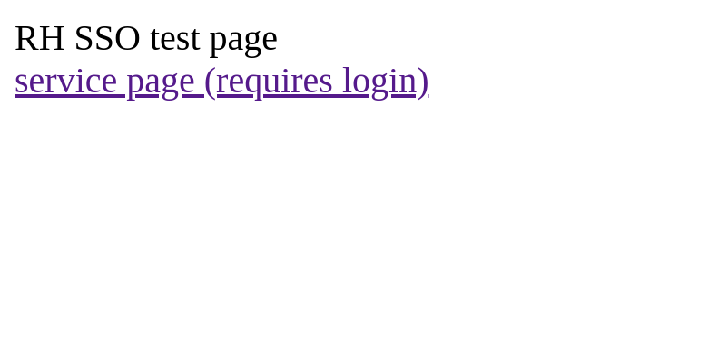
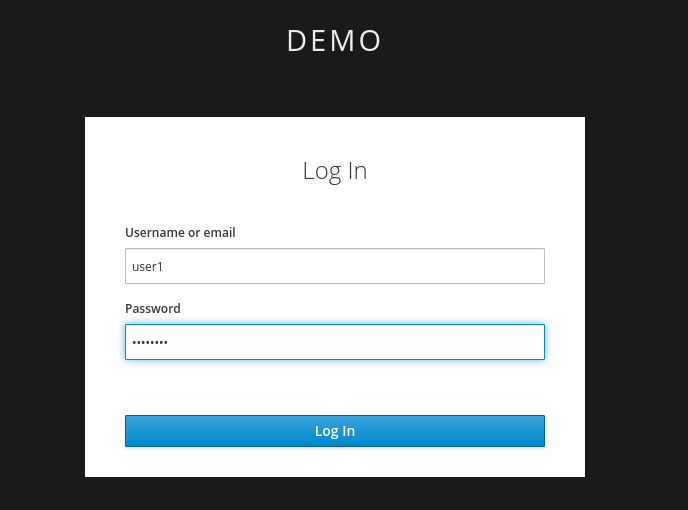
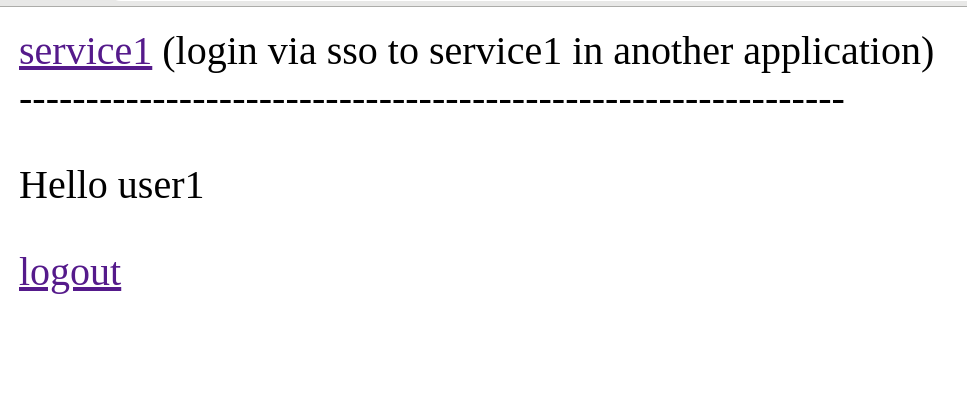
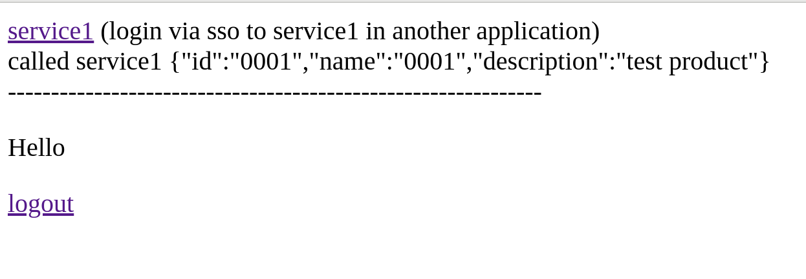
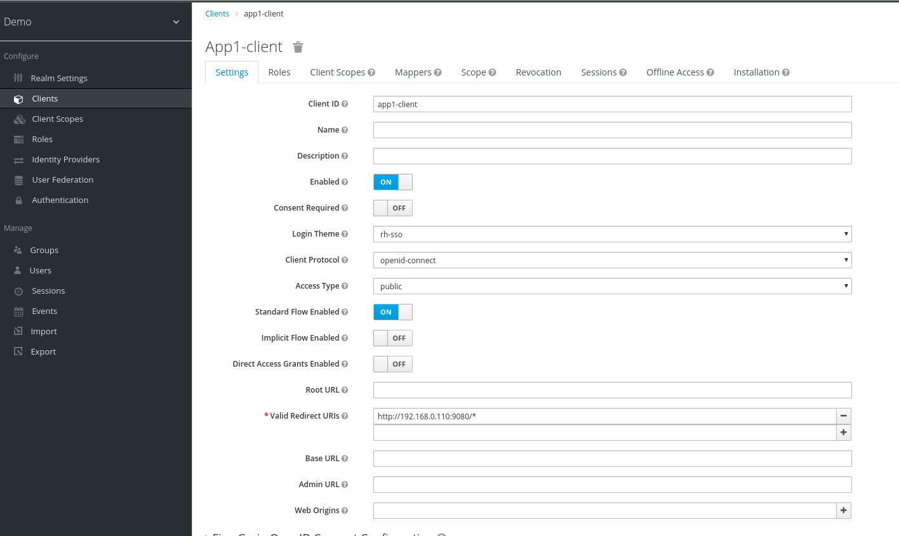
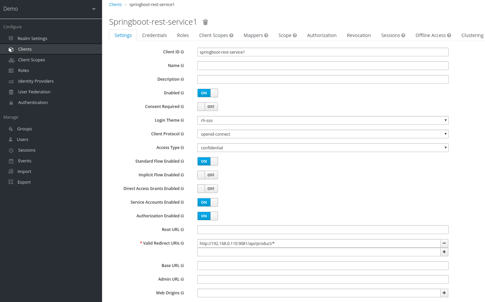
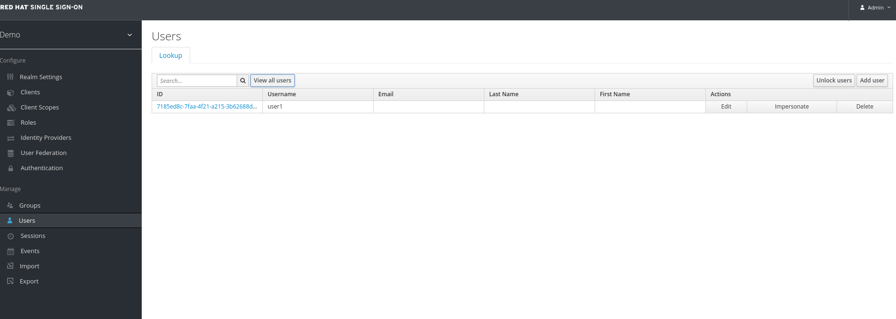
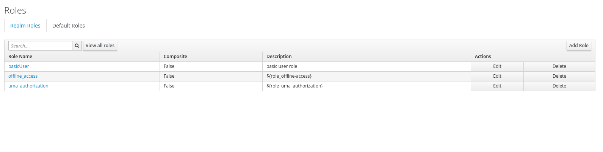

# Test services for RHSSO / keycloak

### Test services
- app1: 
    - web based springboot mvc app, 
    - open endpoint at root context, `/`
    - protected jsp at `/home.page`, which displays an url to invoke a service hosted at `service1` app
- service1: 
    - springboot rest service, protected endpoint at `/api/product/*`, returns an arbituary `product` json payload.
- service2: not used for now

### Basic flow: 

- access index page

- click on `services page` link and access the services via the standard oauth2 authorization code flow.

- click on `service1`, which will access a rest endpoint on another app. The 2nd app is protected under the same realm, and expects the same user role for the web based app.

- gets results

### Springboot settings

- `pom.xml`
    - add keycloak adaptor bom 
- `application.properties`
    - add in the keycloak related settings to protect the urls, and the auth server endpoints  
- in `AppController` of app1, the access token will be stored in session after initial successful login. When we are invoking the service at service1, the access token is retrieved for credential delegation purposes. Once we have the token, we will call the service via a bearer token.

### RHSSO settings (Screen shots)

- client for web app, app1-client

This is via the Authorization Code flow

- client for web app, springboot-service1-client

This is via the Client Credentials flow. In our flow, the app will used the current access token as a bearer token to call the 2nd service

- users and roles 

Realm roles, so it is visible to both clients.

